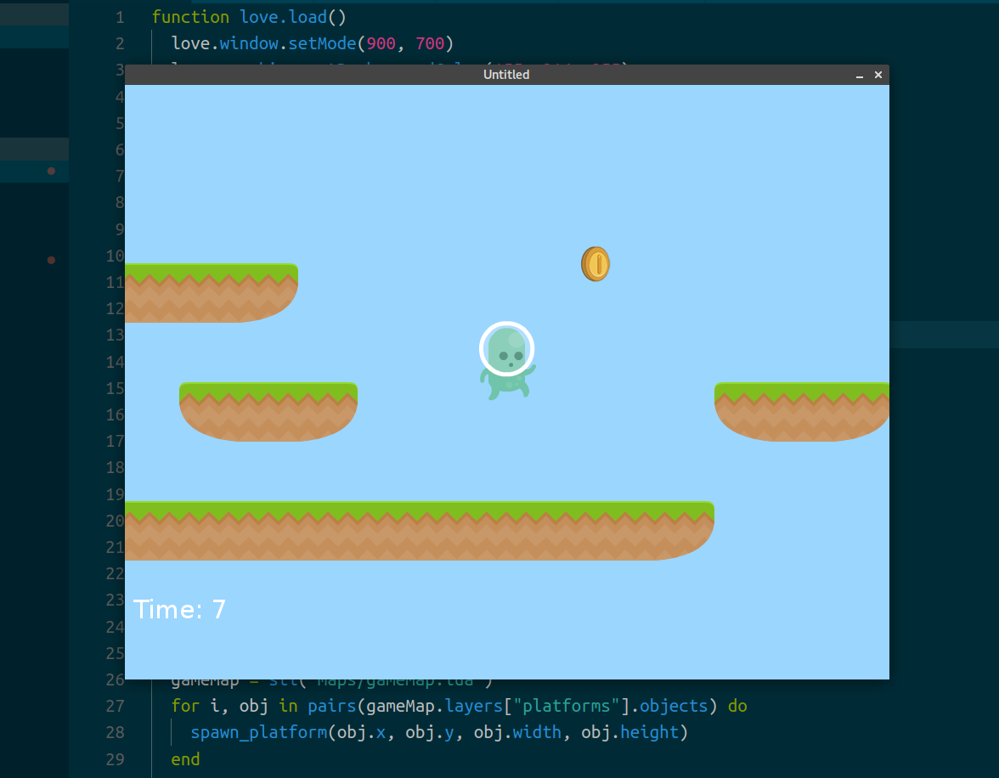

Title: Lua Programming and Game Development with Love2D
Date: 2017-08-25 11:20
Category: Programming

Einen weiteren Kurs bei Udemy abgeschlossen: [Lua Programming and Game Development with Love2D](https://www.udemy.com/lua-love/).

Was soll ich sagen? Ich habe mich unheimlich gefreut als ich dieses Kursangebot bei Udemy gefunden habe. Ich habe schon seit längerem immer mal wieder Kleinigkeiten in Lua geschrieben und wollte mich intensiver mit [LÖVE](https://love2d.org/) beschäftigen, habe aber nie einen richtigen Zugang gefunden. Das ist besonders frustrierend für mich gewesen, weil es als sehr leichtes Framework gilt. 

Aber wie das so ist: Wenn man einen guten Zugang findet, dann stellt es sich am Ende als gar nicht so wild heraus. Und genau diese Erfahrung hat mir der Kurs beschert. Da bekommt man direkt Lust einen 2D-Platformer zu schreiben.

